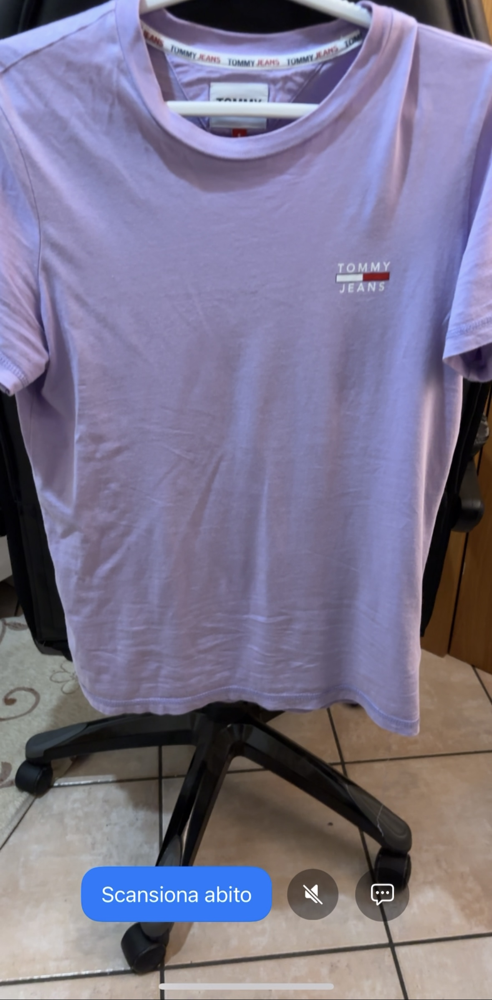
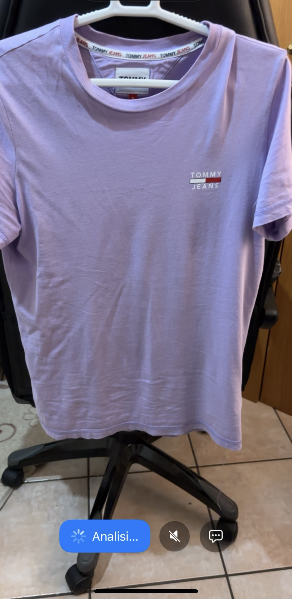
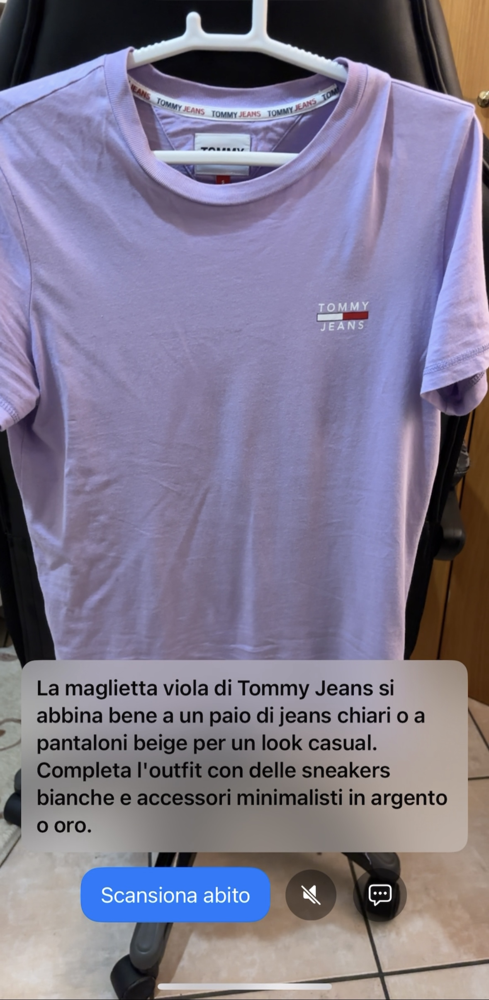
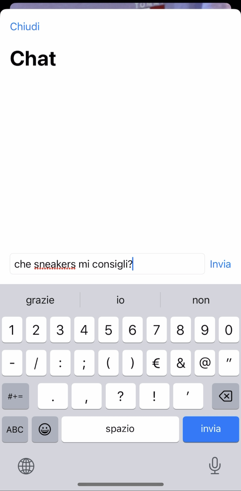
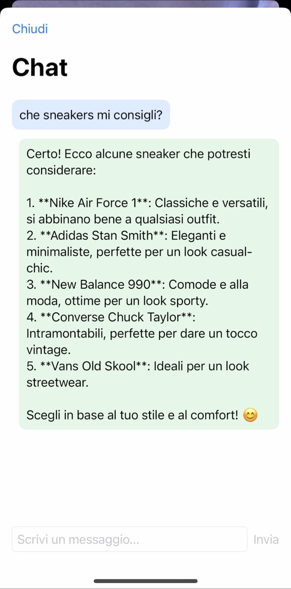

# DressMe (Demo) 👗

A simple, non‑production demo app that uses OpenAI’s GPT Vision to analyze what the device camera sees (e.g., a T‑shirt, jeans, etc.) and generates short styling advice. The advice is both displayed on screen and spoken aloud using natural Text‑to‑Speech.

This project’s goal is to quickly exercise OpenAI Vision and Speech APIs in a minimal, interactive SwiftUI app.

## What it does ✨

- Live camera preview 📷
- One‑tap scan of the current frame sent to OpenAI Vision (`gpt-4o-mini`) 🖼️🤖
- Short, practical styling advice in English (displayed and spoken) 💡🗣️
- Simple chat screen to ask follow‑up questions 💬

## Technologies used 🧰

- SwiftUI for UI 📱
- AVFoundation (AVCaptureSession for camera, AVAudioPlayer for audio playback) 🎥
- OpenAI APIs 🧠:
  - Vision via Chat Completions with image input (`gpt-4o-mini`) 🖼️
  - Text‑to‑Speech (`gpt-4o-mini-tts`) for a natural English voice 🗣️
- URLSession for networking 🌐

## Setup 🚀

1. Requirements 🛠️: Xcode 16+, iOS 17+ device (recommended) or Simulator.
2. Add your OpenAI API key 🔑 to the run scheme (kept local, not committed):
   - Product → Scheme → Edit Scheme… → Run → Arguments → Environment Variables
   - Add `OPENAI_API_KEY = <your_key>`
3. Camera permission 📸: the app requests camera access at runtime.
4. Build & run ▶️ on a real device for the best experience.

> ℹ️ Note: This is a demo; not production‑ready code.

---

## Demo Walkthrough 🎬

📂 Assets live under `DressMe/Demo/`. Below are the key moments.

### 1) Initial screen (camera + actions) 📷

Shows the live camera preview, a button to scan the current frame, a mute button to stop speech, and a chat button to open conversation.

### 2) Processing state ⏳

After tapping Scan, the UI shows a loading state while the app uploads the current frame to the model and waits for the response.

### 3) Speaking advice 🗣️

The model returns a short styling tip; it is displayed and spoken aloud using natural TTS.

### 4) Opening chat 💬

Tapping the chat button presents a simple chat where you can type a message to ask for follow‑up advice.

### 5) Chat response ✅

The model’s text response is shown in the chat as a concise, practical suggestion.

---

## Demo video 🎥

https://github.com/Francesco-Granozio/DressMe/blob/main/DressMe/Demo/demo_video.mp4

*Note: The video above shows the complete demo walkthrough of the DressMe app in action.*

---

## Notes 📝

- The app reads `OPENAI_API_KEY` from the environment at launch.
- For voice output, it tries OpenAI TTS first and falls back to the on‑device English voice if needed.
- Network calls and model choices are tuned for demo responsiveness, not production scale or cost.
